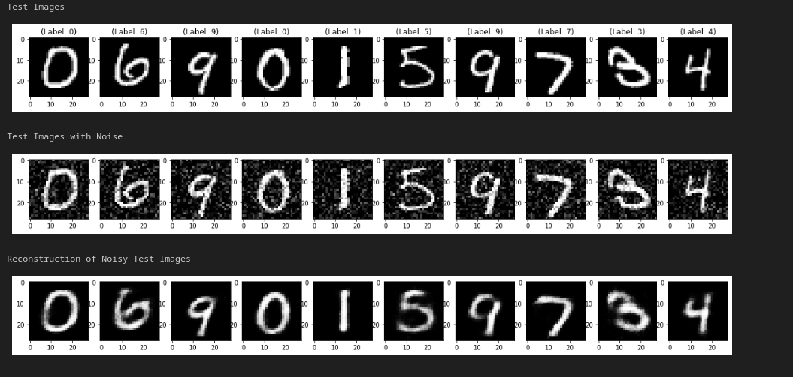

# Autoencoders with Convolutional Neural Network

In this project, I harnessed the power of autoencoders to address the challenge of image denoising.

Autoencoders were employed as a robust solution for restoring the quality of noisy images.

By meticulously training an autoencoder on a dataset of noisy images and compelling it to reconstruct pristine counterparts, the approach enabled the network to acquire the ability to discern and eliminate various forms of noise.

Through this iterative process, the autoencoder progressively refined its understanding of the underlying structure of the images, effectively learning to filter out extraneous noise sources.

As a result, the trained autoencoder exhibited remarkable proficiency in generating remarkably cleaner and clearer versions of the initial input images, showcasing the potential of autoencoders as a valuable tool for image denoising tasks.
